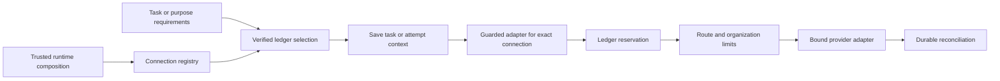

# Inference connections and shared budgets

The runtime supports multiple configured provider connections at once. Explicit
installation rules or a policy-constrained broker select accounts for task execution,
planning, and intent normalization. Tasks pin immutable execution profiles; changing an Agent's current
profile or the installation default cannot redirect an already assigned task.
The supported adapters remain OpenAI API and Codex subscription. This is not a
claim of complete Hermes coverage or support for advanced model transports.

## Installation configuration

Version-2 installation files may contain `provider_routing`. An existing file
without that field retains its single unnamed provider. Named connections require
version-2 inference policies and an explicit route for every inference purpose.
For example, add this section alongside two fully configured provider entries:

```json
"provider_routing": {
  "task_default": "primary",
  "task_connections": { "research": "auxiliary" },
  "planning": "auxiliary",
  "normalization": "auxiliary"
}
```

The two provider policies must use `connection_id` values `primary` and `auxiliary`.
Each retains its exact provider/model/profile, credential reference, authorization,
and per-route limits. Set policy `version` to `2` and include the same reviewed
`organization_budget` in each, for example for zero-cost subscription accounting:

```json
"organization_budget": {
  "window_duration_seconds": 3600,
  "max_tokens_per_window": 100000,
  "continuity_reserve_tokens": 10000,
  "max_cost_nano_usd_per_window": 0,
  "max_concurrent_requests": 2
}
```

These fragments extend a complete reviewed installation; they are not standalone
configuration files. Choose limits appropriate to the authorized work. Metered
routes also require current pricing and a sufficient organization monetary cap.
All policies in an applied set must share organization, author, authorization time,
and organization limits. Changing accounts or routes never resets accumulated usage.

Task rules match exact planned task keys (lowercase letters/digits/hyphens, up to
64 characters). Without routing requirements, a key without a rule uses the explicit
task default. A rule cannot select an absent account or weaken task, completion,
confidentiality, or budget requirements.

Provision every referenced encrypted credential before applying the configuration.
Codex connections need distinct mutable sealed credential stores. After editing
the installed configuration, run `agentos doctor` for offline readiness checks and
`agentos setup providers` to validate the full set, regenerate service credential
directives, and restart the service if it is running. User-mode application requires
the installation owner; system mode uses the existing administrator setup flow.
The apply command does not probe providers or recollect credentials. The singular
`agentos setup provider` wizard remains for single-provider installations and
rejects routed configurations instead of replacing their provider list.

Startup recovers accounting once and activates the reviewed policy set atomically.
Every adapter receives a credential source limited to its configured reference and
a private runtime directory under `connections/<connection_id>`. Partial startup
closes initialized adapters in reverse order. Doctor and generated systemd units
cover every configured account.

## Selection from task and purpose requirements

An account can participate in broker selection when its version-2 inference policy
includes a reviewed `catalog` and organization `routing` policy. The catalog declares
`capabilities`, `local`, `context_tokens`, `output_tokens`, `data_classes`, and
`valid_until`. Identity comes from the enclosing policy. Expiration must fall within
the policy authorization period. Zero capacity means unknown and cannot satisfy a
positive token requirement. Current adapters may advertise only `text`; configuration
cannot activate vision, tools, streaming, or other unimplemented transports.

The policy's `routing` object contains `organization_id`, `locality`, approved
`data_classes`, and optional `allowed_providers` and `denied_providers`. Every active
named account must agree on these organization rules. Change them through the same
atomic policy-set activation used for shared budgets. Both admission and historical
replay enforce agreement.

Add `task_requirements`, `planning_requirements`, and `normalization_requirements`
to `provider_routing` to select accounts independently for each purpose. Each is a
complete requirements object, for example:

```json
{
  "organization_id": "organization-1",
  "capabilities": ["text"],
  "input_tokens": 8000,
  "output_tokens": 1000,
  "locality": "CLOUD_ALLOWED",
  "data_class": "internal",
  "preferred_connections": ["auxiliary", "primary"]
}
```

Use the installation's actual organization and reviewed token/classification limits.
Optional `connection_id` is a hard account constraint; provider allow/deny lists and
`max_cost_nano_usd` further restrict eligibility. `LOCAL_ONLY` prohibits cloud accounts
regardless of preferences. Local catalog metadata does not establish model identity
or confinement, or enable an unsupported local provider setup.

`task_requirements_by_key` maps exact task keys to complete requirements that
intersect mandatory default requirements. Model-generated keys cannot weaken the
default: locality takes the stricter value, provider allowlists intersect, denylists
and capabilities accumulate, token estimates take the larger value, and cost limits
take the smaller value. Organization and data-class labels must match the default;
labels have no implicit sensitivity ordering. Conflicting hard account constraints
or an empty provider intersection fail closed. Preferences can vary by task after
these constraints are applied. Explicit `task_connections` remain hard
constraints and conflicting account choices fail. When no preferences are supplied,
the configured task, planning, or normalization account becomes the first preference.
Preferences apply only after all eligibility checks. Catalog-enabled purposes must
have requirements; startup rejects missing requirements.

The registry selects from a verified ledger snapshot of active policy and account
and organization budgets. It rejects stale catalog metadata, unsupported capabilities,
prohibited destinations/classifications, insufficient context/output capacity, and
unaffordable reservations. Ties use connection ID order. Selection does not reserve
capacity or call a provider; dispatch performs atomic admission again. A budget or
policy change can therefore deny a previously selected route.

Task selection occurs once before preparing its Agent and saving the Task DAG.
Saved tasks retain their constraints across configuration changes. Planning and
normalization select an adapter per attempt before recording their context. Execution
manifests and reservations carry the same requirements; admission and replay compare
them. A failed provider call does not trigger an implicit retry on another account.

Broker decisions also record the selected policy fingerprint, ledger cutoff, ordering
reason and reservation estimate. Replay reconstructs policies and charges at that
cutoff and checks the selected account's eligibility, including organization freeze,
account concurrency and shared budgets. A later refund or policy revision cannot
justify an earlier decision. This check establishes selected-account eligibility;
it does not rank accounts absent from the runtime's configured registry or reproduce
the recorded count of rejected candidates.

## Connection identity

A version-2 inference policy binds a `connection_id`, organization, exact provider,
model, execution profile, authorization, route limits, and organization budget.
Connection IDs contain 1–128 lowercase ASCII letters, digits, hyphens, or underscores.
They identify configured accounts, not endpoints or credentials.

`inference.NewConnectionRegistry` accepts adapters from trusted composition and
wraps each in a `GuardedAdapter` bound to its connection. Lookup requires the exact
ID, including when two accounts use the same provider and model. A lookup has no
implicit default or fallback. Credential resolution and adapter cleanup remain the
responsibility of runtime composition; the registry neither stores credential
metadata nor resolves secrets.



## Resource accounting

Each connection policy requires an explicit organization budget: accounting window,
token allowance, continuity reserve, monetary allowance in nano-USD, and concurrent
request limit. A zero monetary allowance permits zero-cost reservations only.
These limits supplement route limits. Organization totals include all providers,
models, and legacy requests; adding an account or changing a model does not allocate
a fresh organization budget. Connection concurrency is tracked separately, while
organization concurrency covers all outstanding calls.

Admission reserves the maximum authorized input, output, and estimated cost before
invoking an adapter. Successful reconciliation records actual usage; unsent requests
release their reservations. Interrupted calls become uncertain and retain their
full charge. Outstanding reservations continue to count across a window rollover.
Usage that violates a reservation retains the conservative charge.

Every active connection must agree on organization limits. Use
`SQLite.ActivateInferencePolicies` to change a reviewed set atomically. Members must
belong to one organization, have distinct connection IDs, and share author,
authorization time, and organization budget. Changing shared limits requires all
affected connections. A missing member, invalid policy, or outstanding call on a
replaced connection rolls back the entire set. Changing limits preserves prior use.

## History, migration, and recovery

Storage v10 adds connection IDs to inference policies and reservations and permits
one active policy per organization and connection. Historical version-1 policies
retain their original serialization and fingerprints. Their empty connection ID
identifies the legacy singleton; it is never guessed or assigned to a new account.

New reservation events record `admitted_at`, which must equal the accounting row's
admission time and fall within its route window, authorization period, and pricing
validity period. Older events did not bind a precise
admission timestamp. Shared accounting therefore counts their recorded route windows
conservatively when those windows overlap the organization window, rather than
trusting an unbound timestamp. Historical bytes remain unchanged by migration.

Validation matches policies, reservations, and reconciliations to exact events,
checks connection revision lifetimes, and reconstructs shared charges in event order.
Replay maintains running totals within each organization window and rebuilds them
when a policy or window changes; its decisions are tested against a scan-based
reference implementation.
A refund recorded later cannot justify an earlier over-budget admission. Atomic
policy-set changes may contain adjacent revisions with temporarily differing limits;
they must share an authorization and restore agreement before any other event or
the end of history. Recovery validates accounting before marking calls uncertain.
It does not repeat provider calls.

Planning and normalization reservations bind the exact runtime context event when
one exists. Admission and replay verify its account, model identity, routing requirements, and execution
scope. Named connections cannot drop or substitute that reference during replay.
Historical singleton contexts without references and standalone accounting requests
without application context retain their earlier accounting contract.

## Remaining integration

Constraint-preserving fallback, health/latency-aware selection, richer selection and
rejection audit reasons, advanced model transports, additional provider adapters,
and their setup flows remain implementation work. Shared admission performs snapshot validation; its cost on long
histories requires further performance assessment at larger deployment scales.

Tests cover distinct and identical-model accounts, simultaneous reservations,
connection substitution, shared token/cost/concurrency limits, atomic updates,
historical budget decisions, migration, and restart recovery using synthetic models.
These tests do not constitute live-provider or confinement verification.

Concurrent-submission tests verify that separate workflows preserve account
identity in task manifests and usage. The service currently serializes execution;
these tests do not claim parallel model calls.

### Routing rejection evidence

When task assignment, planning selection, or intake normalization selection fails,
the runtime appends `INFERENCE_ROUTE_REJECTED` before returning the failure. The
versioned payload contains a fixed category, an optional SHA-256 fingerprint of
valid requirements, the purpose, and an earlier origin event in the same
organization and work stream. Task assignment references `PLAN_CREATED` and its
agent task key; planning references `WORK_CREATED`; normalization references the
specific `INTAKE_MESSAGE_RECORDED` that triggered selection. Actor attribution is
`runtime`; originating principal and work details remain in the linked evidence.

These diagnostics carry no raw error strings, prompts, credentials, provider
responses, or copied requirements. Invalid requirements and failures outside the
registry may lack a requirements fingerprint. Unknown errors use
`SELECTION_UNAVAILABLE`; cancellation uses `CANCELED`. The diagnostic does not
reserve budget, start an invocation, authorize fallback or retries, or prove
optimality or impossibility across configurations. Existing dispatch admission
remains authoritative.

Admission checks the bounded closed schema and origin linkage in its append
transaction. Inference replay validates the same linkage against earlier events.
Canceled requests get up to five seconds on a separate context to persist the
record. Database failure can prevent persistence; task/planning callers receive
that failure together with the original selection error, while the operator
normalization boundary retains its bounded unavailable diagnostic. No provider
call follows a rejected selection. This covers runtime selection failures;
installation/readiness errors and direct advisory broker calls do not create
work-stream events.

### Reviewed health, latency, and evaluation evidence

An account catalog may include `signals` with `health` (`READY` or `UNAVAILABLE`),
UTC `observed_at` and `valid_until`, and a bounded `evidence_ref`. Optional
`expected_latency_milliseconds` is an estimate; zero means unknown. An optional
`evaluation` identifies a metric, integer `score_basis_points` (0–10000),
`evaluator_id`, and `evidence_ref`. Metric names must be versioned by the operator
when their meaning or calibration changes. Scores from different metrics cannot
satisfy one another's requirements.

These are operator-reviewed catalog inputs bound by the account policy
fingerprint. The runtime checks their shape, freshness, identity, and thresholds;
it does not independently verify the referenced observation or calculate empirical
scores. Model output cannot populate them. A future Lab integration must provide
independent evidence before publishing reviewed updates. Refreshing signals uses
the existing reviewed policy/configuration path and matching registry metadata.
There is no new background probe or mutable health store.

Requirements may set `require_healthy`, `max_latency_milliseconds` (1–86400000),
and `evaluation: {"metric":"classification-v1","minimum_score_basis_points":9000}`.
Missing evidence fails any constraint that needs it. A declared unavailable,
expired, or future-dated signal makes an account ineligible even without caller
opt-in. Legacy catalogs without signals retain their behavior only when no new
constraint requires evidence. Task-key rules preserve health requirements, take
the tighter latency ceiling and higher score threshold, and reject a changed
metric. Existing locality, capability, identity, and budget constraints still apply.

Selection, readiness, atomic reservation and historical replay use the same
eligibility checks. Expiry between selection and dispatch rejects the call;
expiry today does not invalidate an admission supported by valid evidence at its
historical time. Latency estimates do not promise a response deadline. Provider
retry/fallback attempt chains and automatic health measurement remain subsequent
work; these fields do not enable either behavior.
