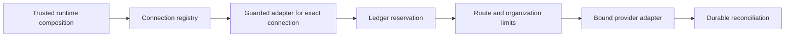

# Inference connections and shared budgets

The inference library and ledger support multiple independently identified
provider connections. Runtime setup still accepts one provider, and task assignment
still uses one model descriptor. This document describes the implemented foundation;
it does not claim that installation, task-specific routing, provider discovery, or
Hermes provider coverage is complete.

## Connection identity

A version-2 inference policy binds a `connection_id`, organization, exact provider,
model, execution profile, authorization, route limits, and organization budget.
Connection IDs contain 1–128 lowercase ASCII letters, digits, hyphens, or underscores.
They identify configured accounts, not endpoints or credentials.

`inference.NewConnectionRegistry` accepts adapters from trusted composition and
wraps each in a `GuardedAdapter` bound to its connection. Lookup requires the exact
ID, including when two accounts use the same provider and model. A lookup has no
implicit default or fallback. Credential resolution and adapter cleanup remain the
responsibility of runtime composition; the registry neither stores credential
metadata nor resolves secrets.

## Resource accounting

Each connection policy requires an explicit organization budget: accounting window,
token allowance, continuity reserve, monetary allowance in nano-USD, and concurrent
request limit. A zero monetary allowance permits zero-cost reservations only.
These limits supplement route limits. Organization totals include all providers,
models, and legacy requests; adding an account or changing a model does not allocate
a fresh organization budget. Connection concurrency is tracked separately, while
organization concurrency covers all outstanding calls.

Admission reserves the maximum authorized input, output, and estimated cost before
invoking an adapter. Successful reconciliation records actual usage; unsent requests
release their reservations. Interrupted calls become uncertain and retain their
full charge. Outstanding reservations continue to count across a window rollover.
Usage that violates a reservation retains the conservative charge.

Every active connection must agree on organization limits. Use
`SQLite.ActivateInferencePolicies` to change a reviewed set atomically. Members must
belong to one organization, have distinct connection IDs, and share author,
authorization time, and organization budget. Changing shared limits requires all
affected connections. A missing member, invalid policy, or outstanding call on a
replaced connection rolls back the entire set. Changing limits preserves prior use.

## History, migration, and recovery

Storage v10 adds connection IDs to inference policies and reservations and permits
one active policy per organization and connection. Historical version-1 policies
retain their original serialization and fingerprints. Their empty connection ID
identifies the legacy singleton; it is never guessed or assigned to a new account.

New reservation events record `admitted_at`, which must equal the accounting row's
admission time and fall within its route window, authorization period, and pricing
validity period. Older events did not bind a precise
admission timestamp. Shared accounting therefore counts their recorded route windows
conservatively when those windows overlap the organization window, rather than
trusting an unbound timestamp. Historical bytes remain unchanged by migration.

Validation matches policies, reservations, and reconciliations to exact events,
checks connection revision lifetimes, and reconstructs shared charges in event order.
Replay maintains running totals within each organization window and rebuilds them
when a policy or window changes; its decisions are tested against a scan-based
reference implementation.
A refund recorded later cannot justify an earlier over-budget admission. Atomic
policy-set changes may contain adjacent revisions with temporarily differing limits;
they must share an authorization and restore agreement before any other event or
the end of history. Recovery validates accounting before marking calls uncertain.
It does not repeat provider calls.

## Remaining integration

Configuration and task routing must bind reviewed tasks to configured connections,
including primary and auxiliary purposes. Capability and context filtering,
destination and locality restrictions, constraint-preserving fallback, additional
provider adapters, and their setup flows remain separate implementation work.
The registry currently records connection identity and adapters, not a complete
capability catalog. Shared admission performs snapshot validation; its cost on long
histories requires performance assessment before broader runtime integration.

Tests cover distinct and identical-model accounts, simultaneous reservations,
connection substitution, shared token/cost/concurrency limits, atomic updates,
historical budget decisions, migration, and restart recovery using synthetic models.
These tests do not constitute live-provider or confinement verification.
